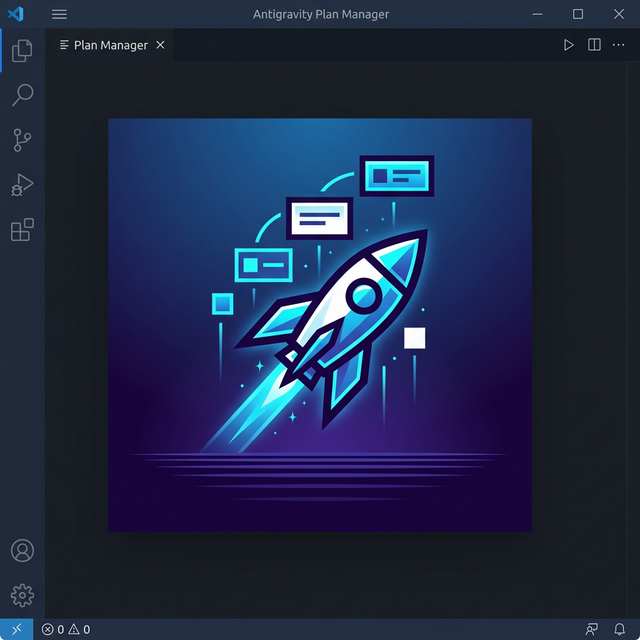

# Antigravity Plan Manager | 反重力计划管理器

[English](#english) | [中文](#chinese)

---

## English

### Features
- **Plan Visualization**: View implementation plans generated by "Antigravity" in a dedicated tree view.
- **Folder Status**: Automatically detect and color-code folder status based on task completion.
- **AI Integration**: One-click to apply plan content to your AI chat interface.
- **Workspace Specific**: Filters and shows only the relevant plans for your current active workspace.
- **Management**: Easy refresh and deletion of plan folders.

### Installation
1. Open Visual Studio Code.
2. Go to the Extensions view (Ctrl+Shift+X).
3. Search for "Antigravity Plan Manager".
4. Click **Install**.

### How to Use
1. Click the **Antigravity (Rocket)** icon on the Activity Bar.
2. Browse through your implementation plans in the "Implementation Plans" view.
3. Click on a file to open it.
4. Use the inline icons to:
    - ⚡ Apply to AI Chat
    - 🗑️ Delete plan folder
    - 🔄 Refresh the list

---

## 中文 (Chinese)

### 功能特性
- **计划可视化**：在专用的树形视图中查看由“反重力”生成的实施计划。
- **文件夹状态显示**：根据任务完成情况自动检测并显示文件夹状态及其相应的视觉标识。
- **AI 对话集成**：一键将计划内容应用到您的 AI 对话框中进行深度讨论。
- **工作区关联**：智能过滤并仅显示与您当前活动工作区相关的计划文件。
- **计划管理**：支持快速刷新列表和删除不再需要的计划文件夹。

### 安装指南
1. 打开 Visual Studio Code。
2. 进入扩展视图 (Ctrl+Shift+X)。
3. 搜索 “反重力计划管理器”。
4. 点击 **安装 (Install)**。

### 使用方法
1. 点击 VS Code 左侧活动栏中的 **反重力 (火箭)** 图标。
2. 在“实施计划”视图中浏览您的所有计划。
3. 点击具体文件即可打开查看。
4. 使用视图中的内联操作图标：
    - ⚡ **应用到 AI 对话**：将计划快速导入聊天上下文。
    - 🗑️ **删除计划文件夹**：清理过期的计划。
    - 🔄 **刷新**：同步最新的计划生成结果。

---

## Technical Details | 技术细节
- **Powered by**: Antigravity Core
- **Platform**: Visual Studio Code ^1.80.0
